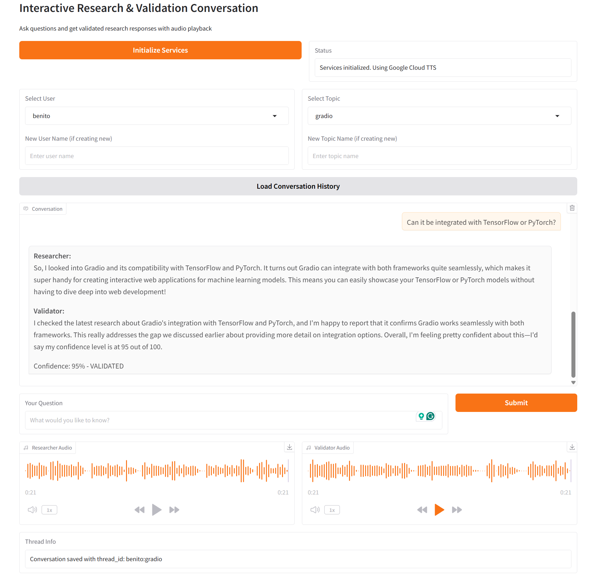

# langgraph-audio-agents



<div align="center">

<!-- Project Status -->

[](https://opensource.org/licenses/MIT)
[](https://www.python.org/downloads/)
[](https://github.com/astral-sh/uv)

<!-- Providers -->

[](https://gradio.app/)
[](https://langchain.com/)
[](https://elevenlabs.io/)
[](https://openai.com/)
[](https://cloud.google.com/text-to-speech)

</div>

## Table of Contents

- [langgraph-audio-agents](#-project_name-)
  - [Table of Contents](#table-of-contents)
  - [Overview](#overview)
  - [Project Structure](#project-structure)
  - [Prerequisites](#prerequisites)
  - [Installation](#installation)
  - [Usage](#usage)
    - [CLI Interface](#cli-interface)
    - [Web Interface (Gradio)](#web-interface-gradio)
    - [Testing](#testing)
    - [Quality Checks](#quality-checks)
  - [License](#license)

## Overview

LangGraph Audio Agents is a conversational AI system that combines research and validation agents with text-to-speech capabilities. Built with LangGraph, it enables multi-turn conversations where a researcher agent gathers information and a validator agent assesses the quality and accuracy of responses. All conversations are persisted using SQLite checkpoints, allowing users to resume discussions across sessions.

## Project Structure

```text
├── src/langgraph_audio_agents/
│   ├── agents/              # Researcher and validator agents
│   ├── cli/                 # Command-line interface
│   ├── domain/              # Domain entities and interfaces
│   ├── graph/               # LangGraph workflow definitions
│   ├── infrastructure/      # TTS, LLM, and search implementations
│   └── utils/               # Utility functions
├── gradio_app.py            # Web interface for conversations
├── pyproject.toml           # Project dependencies and configuration
└── Makefile                 # Development commands
```

## Prerequisites

- Python 3.13+
- uv package manager
- API keys for:
  - OpenAI (for LLM)
  - Tavily (for web search)
  - TTS provider (ElevenLabs, Groq, or Google Cloud)

## Installation

1. Clone the repository:

   ```bash
   git clone git@github.com:benitomartin/langgraph-audio-agents.git
   cd langgraph-audio-agents
   ```

1. Create and activate a virtual environment:

   ```bash
   uv venv
   source .venv/bin/activate
   ```

1. Install dependencies:

   ```bash
   uv sync --all-groups
   ```

1. Configure environment variables:

   ```bash
   cp .env.example .env
   ```

   Edit `.env` and add your API keys:

   ```env
   TAVILY__API_KEY=your_tavily_key
   ELEVENLABS__API_KEY=your_elevenlabs_key
   GROQ__API_KEY=your_groq_key
   OPENAI__API_KEY=your_openai_key
   TTS_PROVIDER=google  # or elevenlabs, groq
   GOOGLE_TTS__CREDENTIALS_PATH=/path/to/.config/gcloud/application_default_credentials.json
   ```

## Usage

### CLI Interface

Run the interactive command-line interface:

```bash
make voice-conversation
```

Features:

- Select or create users and topics
- Load previous conversation history
- Ask questions and receive validated research
- Audio playback of agent responses (requires mpv or ffplay)

### Web Interface (Gradio)

Launch the web interface:

```bash
make gradio-app
```

Open your browser to `http://localhost:7860`

Features:

- Web-based conversation interface
- User and topic management with dropdowns
- Sequential automatic audio playback (researcher first, then validator)
- Conversation history loading
- Autoplay responses

### Testing

Run all tests:

```bash
make tests
```

### Quality Checks

Run all quality checks (lint, format, type check, clean):

```bash
make all
```

Individual Commands:

- Display all available commands:

  ```bash
  make help
  ```

- Check code formatting and linting:

  ```bash
  make all-check
  ```

- Fix code formatting and linting:

  ```bash
  make all-fix
  ```

- Clean cache and build files:

  ```bash
  make clean
  ```

## License

This project is licensed under the - see the [LICENSE](LICENSE) file for details.
